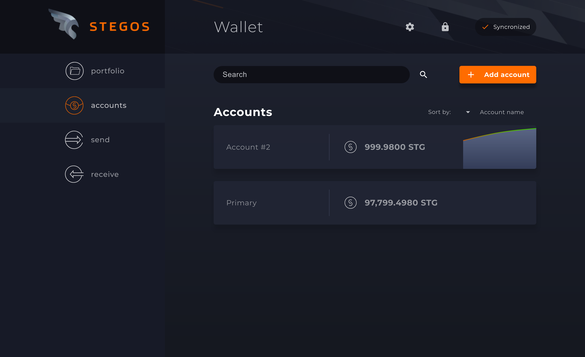

# Stegos Wallet

[![Build Status][build-badge]][build-url]

Electron-based Wallet application for [Stegos](https://github.com/stegos/stegos) blockchain.



## Installation

Download packages for Linux and Mac from [GitHub Releases](https://github.com/stegos/stegos-wallet/releases). All packages ship with bundled version of [Stegos Node](https://github.com/stegos/stegos/releases).

## Development

### Prerequirements to build on windwos:

- Windows 7+ / Windows Server 2003+
- We use Chocolatey package manager, in order to use it, you need to have PowerShell v2+ installed.
- Also Chocolatey needs .NET Framework 4+ (the installation will attempt to install .NET 4.0 if you do not have it installed)

0. Install requirements:

- [Yarn Package Manager](https://yarnpkg.com/en/docs/install), version 1.13.0 tested.
- [NodeJS](https://nodejs.org/en/download/), version v10.16.0 tested.

### Install dependencies on windows:

#### Install Chocolatey package manager

Note: Chocolatey is only used to install nodejs and yarn, and for consistency with `stegosd` `msys` installation.

`@"%SystemRoot%\System32\WindowsPowerShell\v1.0\powershell.exe" -NoProfile -InputFormat None -ExecutionPolicy Bypass -Command "iex ((New-Object System.Net.WebClient).DownloadString('https://chocolatey.org/install.ps1'))" && SET "PATH=%PATH%;%ALLUSERSPROFILE%\chocolatey\bin"`

#### Install native tools (Yarn, NodeJS):

`choco install nodejs yarn`

#### To Build on node-gyp on windows, you need windows-build-tools:

Use yarn to install windows-build-tools globally:

`yarn global add windows-build-tools`

#### Sass library.

For Ubuntu, Macos and most of other linux desktop distributions, libsass is preinstalled.
But for Windows, and some linux slim builds (ubuntu wsl), you should install sass library manually.
You can do it trough npm:

```
npm install node-sass
```

### Running a local Node

1. Clone this repository:

```
git clone https://github.com/stegos/stegos-wallet.git
cd stegos-wallet
```

2. Get the latest version of [Stegos Node]() for your platform:

```
mkdir node
curl -L https://github.com/stegos/stegos/releases/download/v1.0/stegosd-linux-x64 -o node/stegosd
chmod a+x node/stegosd
./node/stegosd --version
```

For windows you also need download next dlls from stegosd release (libgcc_s_seh-1.dll,
librocksdb-shared.dll, libstdc++-6.dll, libwinpthread-1.dll ).

3. Build and run Wallet application:

```
yarn install
yarn dev
```

#### Run with arguments

```
--chain <NAME>
```

Specify chain to use: testnet|devnet|mainnet

```
--data-dir <DIR>
```

Path to data directory, contains api.token file

```
--api-endpoint <ENDPOINT>
```

API ENDPOINT, e.g. 127.0.0.1:3145 [default: 127.0.0.1:3145]. If you want to run multiple wallets at the same you time, you should set this param.

```
--debug
```

Launches prod version with debug console

## Feedback

Please join us on [Telegram Chat](https://t.me/stegos4privacy) to get test tokens and let us know your thoughts.
Subscribe to official [Telegram Channel](https://t.me/stegos4privacy_official) for the latest news.

[build-badge]: https://gitlab.aws.stegos.com/Stegos/stegos-wallet/badges/develop/pipeline.svg
[build-url]: https://gitlab.aws.stegos.com/Stegos/stegos-wallet/commits/develop
